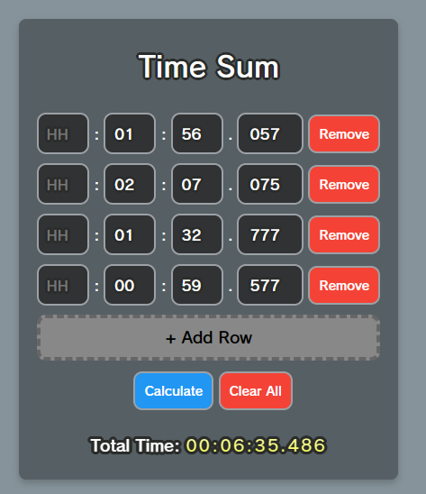

# Time Sum

A simple tool to calculate the sum of times.

## Usage

Simply input your times in HH:MM:SS.mmm format. Add or remove rows as needed.

Then, click "Calculate" to see the result

## Why

Because I needed an easier way to calculate the IGT of Mario Kart speedruns.
